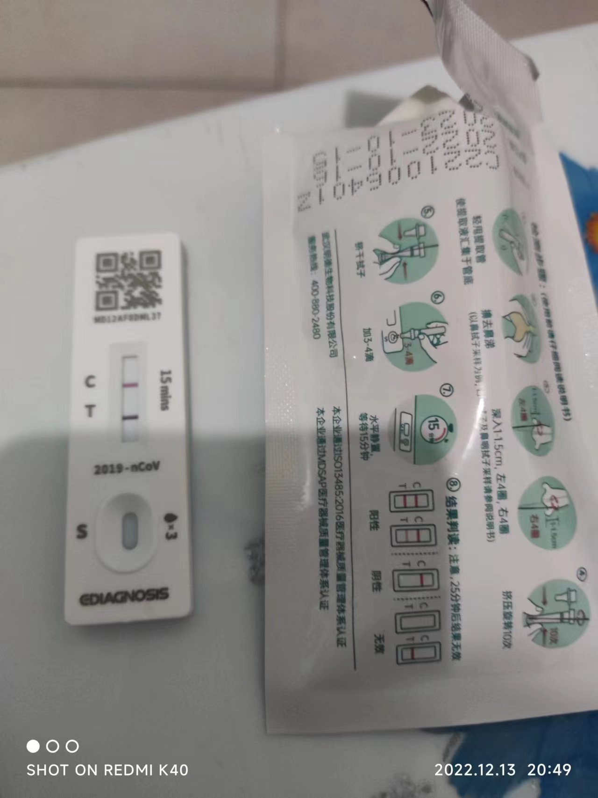

# 2022-12-09
## 身体情况说明
全员居家远程办公
感觉这天整体已有明显好转,几乎没有太多症状,除了轻微嗓子与咳嗽,有痰

早上症状: 无什么大问题
中午无食欲继续吃了点稀饭[第二锅]
饭后吃药: 999一袋,板蓝根一袋,氨加黄敏胶囊二粒
晚上出去取了一个快递,由于天气较冷,口罩问题,整个路程有点喘,回来后有很轻微的症状复发
晚上食欲好,炒了土豆丝一盘
饭后吃药: 999一袋,板蓝根一袋,氨加黄敏胶囊二粒

## 行程记录
晚8:00出中街北门取快递(京东) >> 
原路返回

## 抗原检测
回家后8:25左右开始
按照说明书进行采样检测: 
    滴入后,非常快的看到T处有一道远看为黑,近看偏紫色的线,慢慢在C处有了粉色线
没有管他,先去炒了一份土豆丝
待到8:40后查看,仍是两道线,我了个去,就这么中招了......
